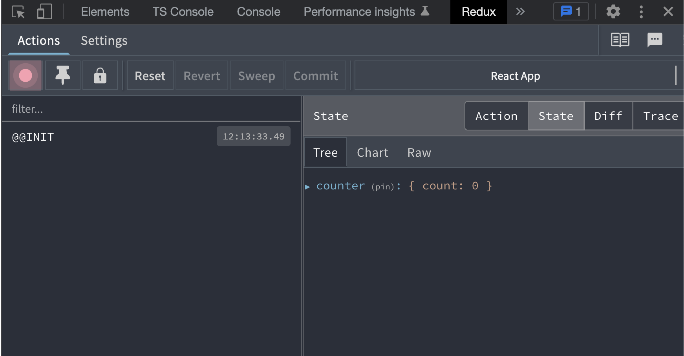

# Workbook - Steg-för-steg
## Counter-komponent med useState

1. Skapa react app

```sh
npx create-react-app redux-with-test --template typescript
```

2. Skapa Counter.tsx

```tsx
//Counter.tsx
import React, {useState} from 'react';

const Counter = () => {
    const [ count, setCount ] = useState(0);
    return <>
        <p>Count: {count}</p>
        <button onClick={() => setCount(count-1)}>-1</button>
        <button onClick={() => setCount(count+1)}>+1</button>
    </>
}
export default Counter;
```

3. Rensa App.tsx och lägg in Counter

```tsx
//App.tsx
import React from 'react';
import Counter from './Counter';

const App = () => (
  <>
    <Counter />
  </>
)
export default App;
```
---

4. Ta bort App.test.tsx

Ta bort *App.test.tsx* då testfallet inte längre är aktuellt.

---

```sh
# Checka ut koden fram till hit
git checkout 1-counter-with-usestate
```
---

## Lägga in Redux

1. Installera npm-paket

```sh
npm install redux
npm install @reduxjs/toolkit
npm install react-redux
```

2. Skapa counterSlice.ts

```ts
// store/counterSlice.ts
import { createSlice } from '@reduxjs/toolkit'

const counterSlice = createSlice({
  name: 'counter',
  initialState: { count: 0 },
  reducers: {
    increase(state, action) {
      state.count++;
    },
    decrease(state, action) {
      state.count--;
    }
  }
})

export const { increase, decrease } = counterSlice.actions
export default counterSlice.reducer
```

3. Skapa store/index.ts och lägg in counterReducer

```tsx
// store/index.ts

import { configureStore } from '@reduxjs/toolkit'
import counterReducer from './counterSlice'

export const store = configureStore({
  reducer: {
    counter: counterReducer,
  }
})
```

4. Lägg in Provider i index.tsx

```tsx
// index.tsx
import React from 'react'
import ReactDOM from 'react-dom/client'

import { Provider } from 'react-redux'
import { store } from './store'

import App from './App'

const root = ReactDOM.createRoot(document.getElementById('root') as HTMLElement)
root.render(
  <Provider store={store}>
    <App />
  </Provider>
)
```


5. Installera Chrome Redux DevTools

- https://chrome.google.com/webstore/detail/redux-devtools/lmhkpmbekcpmknklioeibfkpmmfibljd?hl=en

```sh
npm start
```

- Öppna sidan i Chrome och kontrollera att Redux fungerar genom att öppna Redux DevTools. Om State innehåller *counter* är allt ok!

  

---

```sh
# Checka ut koden fram till hit
git checkout 2-redux-installed
```
---

## Refaktorisera Counter att använda Redux

1. Använd Redux i Counter.tsx

```diff
import React, {useState} from 'react';
+import { useSelector, useDispatch } from 'react-redux'
+import { increase, decrease } from './store/counterSlice';

const Counter = () => {

    
-    const [ count, setCount ] = useState(0);
+   const dispatch = useDispatch();
+   const count = useSelector(state => state.counter.count);
    return <>
        <p>Count: {count}</p>
+        <button onClick={() => dispatch(decrease())}>-1</button>
-        <button onClick={() => setCount(count - 1)}>-1</button>
+        <button onClick={() => dispatch(increase())}>+1</button>
-        <button onClick={() => setCount(count + 1)}>+1</button>
    </>
}
export default Counter;
```

2. Testa i Chrome

```sh
npm start
```

- Öppna sidan i Chrome och kolla vad som händer i Redux DevTools när man trycker på plus- och minusknapparna

---

```sh
# Checka ut koden fram till hit
git checkout 3-counter-with-redux
```
---

## Enhetstesta reducerfunktioner

- Skapa testfil för counterSlice:

```ts
// store/counterSlice.spec.ts

import reducer, { increase, decrease } from './counterSlice';

describe('counterSlice', () => {

    it("should return the initial state", () => {
        expect(reducer(undefined, { type: undefined })).toEqual({
            count: 0
        })
    })
    
    it("increase by one when dispatching increase action", () => {
        const previousState = { count: 5 };
        expect(reducer(previousState, increase())).toEqual({
            count: 6
        })
    })

    it("decrease by one when dispatching decrease action", () => {
        const previousState = { count: 5 };
        expect(reducer(previousState, decrease())).toEqual({
            count: 4
        })
    })

})
```
---

```sh
# Checka ut koden fram till hit
git checkout 4-unit-test-counter-slice
```
---

## Lägga till en action med Payload

- Lägg till reducerfunktionen *increaseByX(x: number)* i counterSlice:

```diff
// counterSlice.tsx

...

+increaseByX(state, action: PayloadAction<number>) {
+    state.count+=action.payload; 
+}

...

-export const { increase, decrease } = counterSlice.actions
+export const { increase, decrease, increaseByX } = counterSlice.actions

```

- Lägg till testfall för den nya funktionen:

```diff
//counterSlice.spec.ts
-import reducer, { increase, decrease } from './counterSlice';
+import reducer, { increase, decrease, increaseByX } from './counterSlice';

...

+it("increase by 5 when dispatching increaseByX action sending 5 as payload", () => {
+    const previousState = { count: 5 };
+    expect(reducer(previousState, increaseByX(5))).toEqual({
+        count: 10
+    })
+})

+it("decrease by 5 when dispatching increaseByX action sending -5 as payload", () => {
+    const previousState = { count: 15 };
+    expect(reducer(previousState, increaseByX(-5))).toEqual({
+        count: 10
+    })
+})

...

```
---

```sh
# Checka ut koden fram till hit
git checkout 5-add-payload-action
```
---
## Extra: Implementera Typescript för Redux

Baserat på https://redux.js.org/usage/usage-with-typescript

1. Lägg till *RootState* och *AppDispatch* längst ner i store/index.ts

```tsx

...

// Infer the `RootState` and `AppDispatch` types from the store itself
export type RootState = ReturnType<typeof store.getState>
// Inferred type: {posts: PostsState, comments: CommentsState, users: UsersState}
export type AppDispatch = typeof store.dispatch

````

2. Skapa en store/hooks.ts

```ts
// store/hooks.ts

import { TypedUseSelectorHook, useDispatch, useSelector } from 'react-redux'
import type { RootState, AppDispatch } from './'

// Use throughout your app instead of plain `useDispatch` and `useSelector`
export const useAppDispatch: () => AppDispatch = useDispatch
export const useAppSelector: TypedUseSelectorHook<RootState> = useSelector
```

3. Typa counterSlice

```diff
// counterSlice.tsx
import { createSlice, PayloadAction } from '@reduxjs/toolkit'

+interface CounterState {
+    count: number
+}

+const initialState: CounterState = {
+    count: 0
+}

const counterSlice = createSlice({
    name: 'counter',
-    initialState: { count: 0 },
+    initialState,
    reducers: {
        increase(state, action: PayloadAction<void>) {
            state.count++;
        },
        decrease(state, action: PayloadAction<void>) {
            state.count--;
        },
        increaseByX(state, action: PayloadAction<number>) {
            state.count += action.payload;
        }
    }
})

export const { increase, decrease, increaseByX } = counterSlice.actions
export default counterSlice.reducer
```

4. Byt ut useDispatch / useSelector mot useAppDispatch / useAppSelector

```diff
# Counter.tsx
import React from 'react';
+import { useAppSelector, useAppDispatch } from './store/hooks';
-import { useSelector, useDispatch } from 'react-redux';
import { increase, decrease } from './store/counterSlice';

const Counter = () => {

+    const dispatch = useAppDispatch();
-    const dispatch = useDispatch();
+    const count = useAppSelector((state) => state.counter.count);
-    const count = useSelector((state: any) => state.counter.count);
    return <>
        <p>Count: {count}</p>
        <button onClick={() => dispatch(decrease())}>-1</button>
        <button onClick={() => dispatch(increase())}>+1</button>
    </>
}
export default Counter;
```

---

```sh
# Checka ut koden fram till hit
git checkout 6-add-typescript
```
---